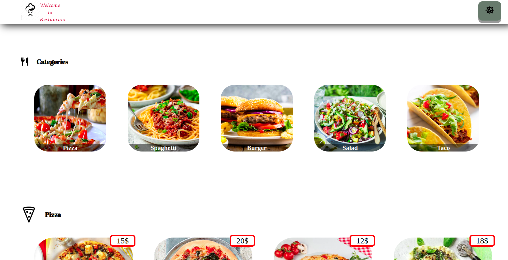

# Restaurant

## `Table of Contents`

* [ About The App ](#about)
* [ Install ](#insatll)
* [ Run the app ](#run)


## `About the application`
The application is about Restaurant menu where you can choose dishes by photoes and prices.




## `Run the app`

Downoad [ZIP](https://github.com/Tamar0/cooking/archive/refs/heads/main.zip) or Clone:
```
git clone https://github.com/Tamar0/cooking.git
```

### open index.html in the browser
